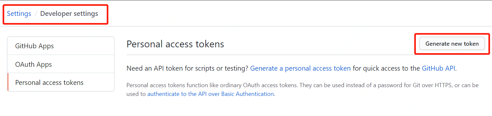
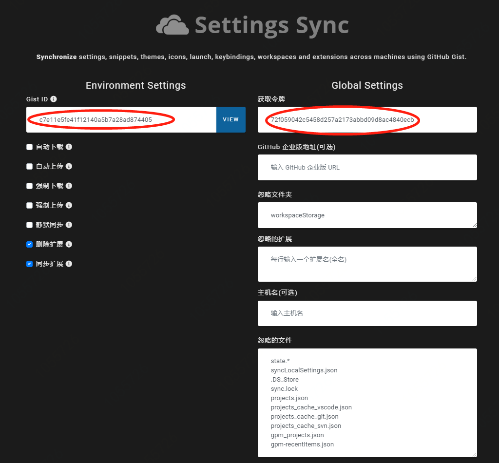

# vscode 安装 Settings Sync 插件同步设置

## github 生成 Access Token

### 登录 github 进入`Settings / Developer settings`配置界面，点击`Generate new token`



### 生成新的 Access Token，勾选 gist


### 记录生成的 Access Token

```github token
macos_vscode_settings_sync: 97dd4f51fcb43a9bbd6ad355b759c4a095e13d10
windows_vscode_settings_sync: 97078c69b050f839738f2d95b95544426e6e9869
```


## vscode Settings Sync 插件配置


### 1. 登录 github 并列出所有 gists，选择一个 gists 同步数据（如果还没有 gists 的话会自动创建一个）


### 2. 打开 vscode Settings Sync 配置页，输入 Gist ID（执行第 1 步后会自动填上），输入令牌（即 github `Developer settings`生成的 token）



## 登录 github 查看同步结果


